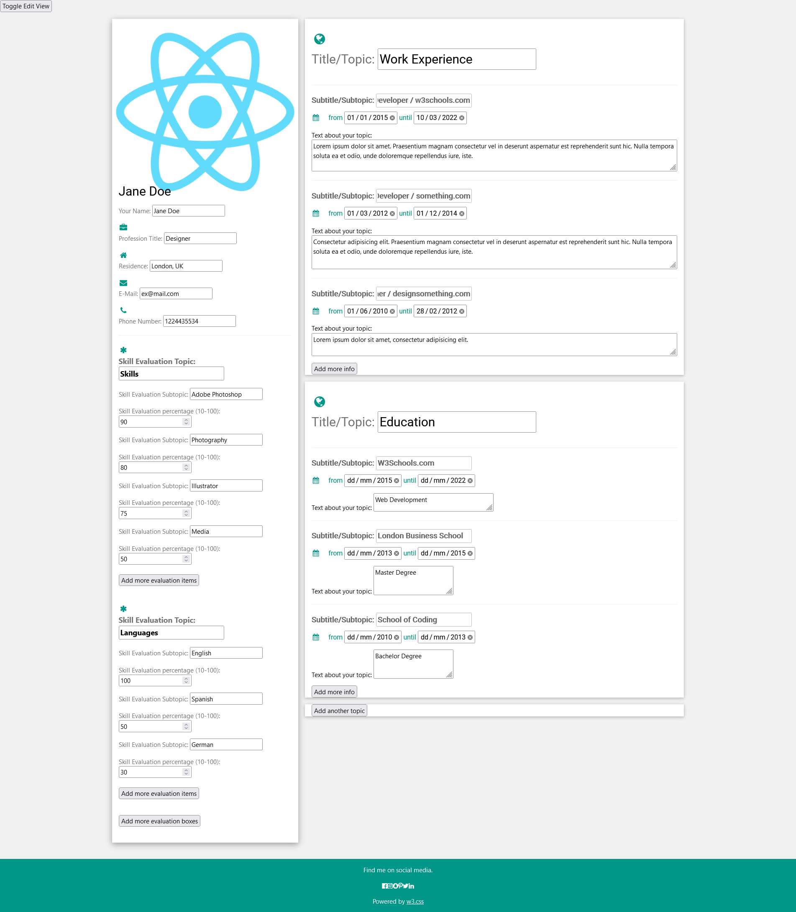
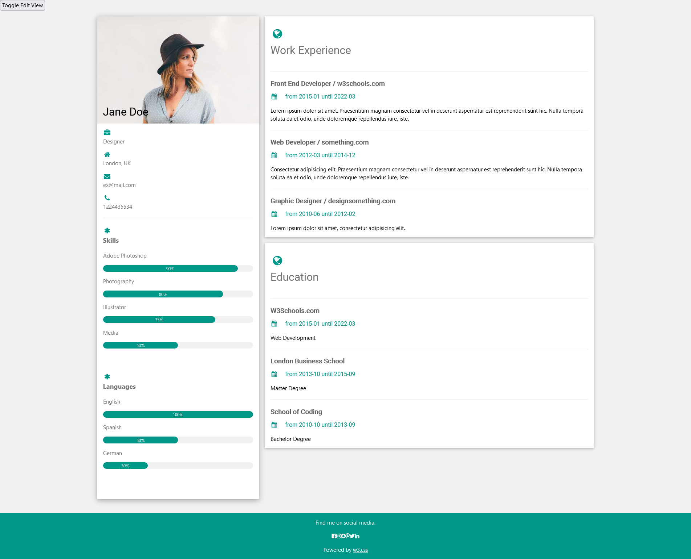
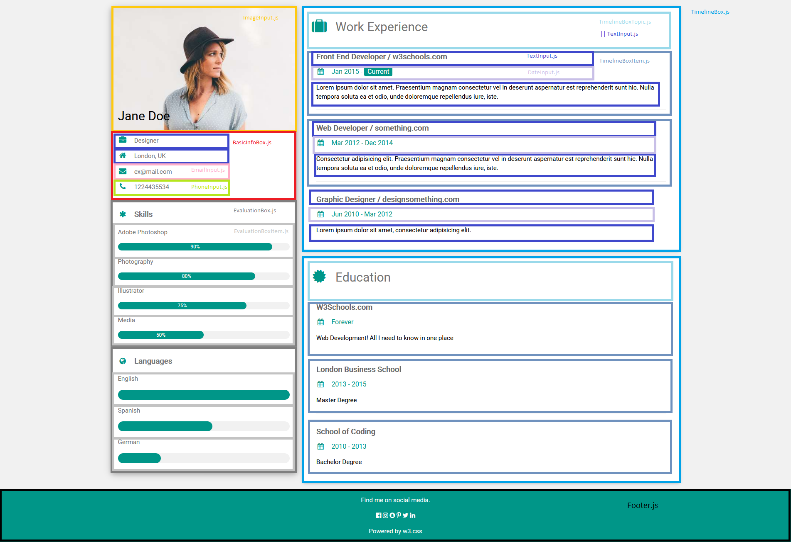
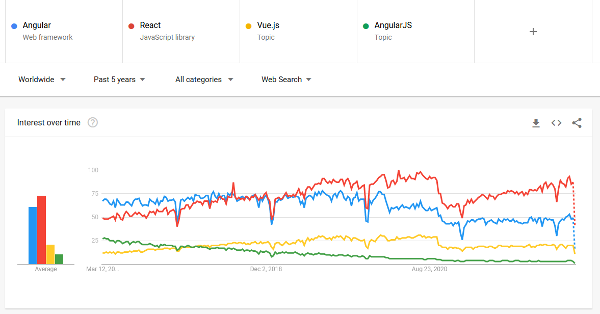
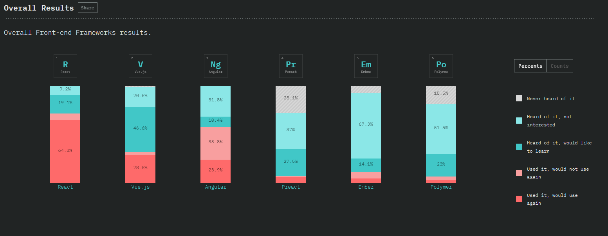
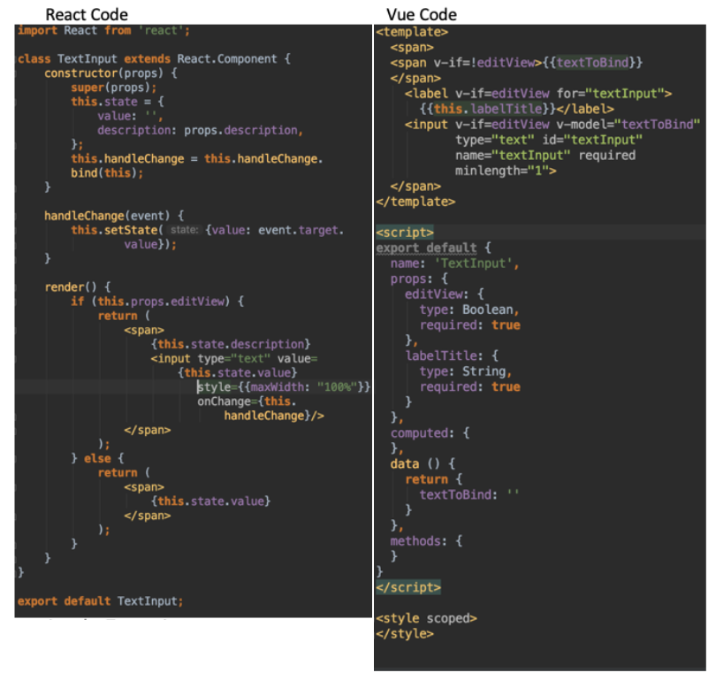

# Implementation of a portfolio-builder user interface written with the React JavaScript frontend framework
German: Implementierung einer Nutzeroberfläche mittels des React Javascript Frontend Frameworks am Beispiel einer Portfolio Webseite

React homepage: https://reactjs.org/

## Table of Contents
- [Overview](#overview-what-is-this-project)
- [Motivation](#my-motivation-behind-this-project)
- [Usage](#usage)
- [Why React](#why-react-as-a-javascript-frontend-framework)
- [Conclusion](#conclusion-and-personal-opinion)
- [Improvements](#improvements)
- [References & Citations](#references--citations)
<!-- - [License](#license) -->

## Overview: What is this project?

This small app is a portfolio / cv / resume builder where you can:
1. fill out various types of fields with data about yourself e.g. your name, address, contact data, working experience, skills and more
2. dynamically add new fields and text-boxes if you want to do so, e.g. three boxes covering your working experience, five boxes describing skills
3. dynamically switch between an edit and a static/read-only/rendered type of view

Here's how it looks like when running the code with ``npm install -> npm start`` (requires Node.js to be installed locally):

### The edit view

### The rendered view

### Understanding the classes

In order to make the classes more understandable for others I have visualized the component hierarchy which you can see below. The yellow box is the ImageInput component.

## My motivation behind this project
 I have written this application in order to learn one of the most popular JavaScript frontend frameworks called "React" that is developed and maintained by Meta Platforms, Inc. (formerly Facebook, Inc.).
 As the framework is based on JavaScript the main goal was to focus on this aspect only instead of building a HTML structure and CSS layout from scratch by myself.
 Therefore I came up with the idea of utilizing an open source static html and css template and adding JavaScript elements to it. 
One of the main strengths of JavaScript is that you are able to modify a static webpage and its Document Object Model (DOM) in order to add dynamic features to it, without having to reload it.

The template that I have chosen and used is provided by w3schools and can be found at the following URL: https://www.w3schools.com/w3css/tryw3css_templates_cv.htm.
 As you can see there, the template is a static page displaying information commonly found in a cv. 
 Now if you would want to write something different about yourself or add more text boxes you would need to open up the html file and modify it.
 Though if you expect that the information is going to change often, which is definitely the case when writing your cv/portfolio, it would be more comfortable to switch from a rendered to a dynamic edit view, add new boxes, fill out some fields and then switch back to the rendered view. 
 This would be much more user-friendly and this is what I tried to achieve in this React learning project.

(Note: I repeated the same idea with the Vue.js JavaScript frontend framework found in my other projects https://github.com/Kirshma/js-vuejs-portfolio-app)

## Usage
Requires you to have Node.js installed on your machine in order to  run npm commands which can be downloaded at https://nodejs.org/en/.

Use the terminal to change directory to the program folder and type:
 ``npm install`` 
 then after the downloads finish type:
 ``npm start`` (if errors exist maybe run ``npm i -S react-scripts``)

The standard output is at: http://localhost:3000/.

I'm not sure if it works on a macOS or Linux system.

To stop the application go back to the terminal and press CTRL + C. The terminal should print: "Terminate batch job (Y/N)?" which you answer by typing: "y" in order to terminate the localhost service.

## Why React as a JavaScript frontend framework?
Building and maintaining a web appearance is a common practice for most companies and businesses.
In order to build an appealing user interface the aid of a frontend framework,
especially one written by a highly reputable company such as Google, Facebook or another is of invaluable help.
This cuts down the development time needed as it offers a well-thought-out system and many pre-defined features that speed up the programming task at hand.
Such frameworks offer a thorough documentation, constant updates and improvements and are therefore, despite an initial learning-curve, the way to go in regards to professional programming.

The question arises which framework to choose for your project specifically. Nowadays there are quite a few big competitors in this field namely the Angular framework by Google (Alphabet Inc.) and the open-source Vue.js JavaScript framework. This is why I started to research when and why you would choose React as your frontend framework of choice.
There's a lot to say about the intricacies of each of these three which I won't explain in detail here. Instead I would like to show some statistics and metrics in terms of the popularity of these aforementioned JavaScript frontend frameworks.

One of the best resources for helping with the decision on which JavaScript frontend framework to choose that I have found is the GitHub project over at https://gist.github.com/tkrotoff/b1caa4c3a185629299ec234d2314e190.
The project gathers and combines various statistics and metrics in regards to the popularity of the frameworks in an in-depth fashion.

In the following I show some of those but there is much more to be found over at the link mentioned above.

### Popularity measured by Google Trends
According to Google Trends React is the most searched JavaScript Frontend Framework in comparison to its direct competitors Angular and Vue.js
[[1]](#1-google-trends). Although the amount of searches doesn't tell us much about the frameworks quality e.g. does high volume of searches mean that people are interested in it (rather positive connotation) or is it maybe due to errors that occur with the given framework (negative connotation), it can be combined with the other statistics and metrics below to paint a clear picture as you will see.

### Popularity measured by npm (packet manager) downloads and dependencies

Both the amount of npm packet manager downloads and dependency references are in favor of React [[2]](#2-npm). This is a more useful stat as this shows us which of the frameworks is downloaded the most and as such with a high likeliness also used in real projects though these can be hobby projects. So the question still stands which of the three is the most popular in a professional setting (answered by the hiring trends and developer survey below).

The same can be seen when looking at the amount of Stack Overflow related questions to each of the JavaScript frontend frameworks [[3]](#3-stack-overflow).

## Popularity in terms of hiring trends by HackerNews

A very interesting statistic about the job market is provided by HackerNews hiring trends which shows that React is in the lead here as well, meaning your job prospects are excellent by being proficient with React [[4]](#4-hiring-trends). It is also clear that this has been the case over a long period of time.

## Developer sentiment survey by stateofjs.com

Lastly I want to point out another valuable resource - an analysis performed by stateofjs.com in 2018 where they asked developers about their experience and their sentiments towards the JavaScript frontend frameworks.
This work gives us insight how those who use it the most - the developers themselves - feel about the respective framework's utility.

When looking at the results we can see that of all of the developers that have used React (both red shades), a vast majority rate it positively, being the classification "Used it, would use again".
 In contrast, the majority of the developers that have used Angular rate it negatively ("Used it, would not use again"). Of the developers who only have heard of Angular but have not used it (both blue shades) the majority answered that they are not interested in it despite hearing and knowing about it.
 Finally Vue.js seems to be the underdog of those three because the blue shades take up the most of the bar meaning most of the participants only heard about the framework but haven't used it yet.
Despite being rarely in use by the participants of the survey most developers still rate it in a positive way with a high amount of "Used it, would use again" and "Heard of it, would like to learn" votes [[5]](#5-developer-survey). 

### Conclusion and personal opinion

This research has informed me about the state of the art of JavaScript frontend frameworks.  To conclude the top three major players of this market are React, Vue.js and Angular.
  The statistics and metrics regarding these three paint a clear picture that React seems to be the most popular one as well as being liked by developers that have used it.
  When looking at what companies use React we can see that it is utilized in the frontends of all Meta Platforms, Inc. (formerly Facebook, Inc.) services including applications such as Whatsapp, Instagram and Oculus VR,
as well as in the frontends of other big companies like DropBox, Netflix, PayPal, Shopify, Airbnb and more [[6]](#6-10-famous-websites-built-with-react-js).
 All in all this makes this framework a solid choice for your project's frontend needs.
 The second place in my opinion goes to Vue.js as it seems to be a framework that benefits from being open-source, is a good alternative to React and most professionals are interested in learning about it someday if React wasn't so widespread and popular. 

This is why have decided to focus on programming a small application with the aid of both of these frameworks.
In my opinion both were intuitive, fun to learn and effective, and I would definitely recommend both of these frameworks for the development of frontends.

For those interested here is a side-by-side comparison of the basic textInput class code in both frameworks:

<!-- ## License -->

## Improvements
There is still a lot that can be done in order to improve this application. My goal has majorly been to learn to use the framework and not to build a fully fledged application.
 Here are some things that could be done for improvement:
1. Number one thing is you can only add new boxes but not delete unwanted ones
2. Some inconsistencies with the date input where you have to put in the whole date, with the day, else the rendered view displays it incorrectly
3. Button descriptions and placements
4. Some UI elements are mispositioned and a bit "off"
5. Fancier buttons
6. I highly value writing tests but didn't do it for this project

# References & Citations

#### [1] Google trends
URL (checked 08.03.2022): https://trends.google.de/trends/explore?date=today%205-y&q=%2Fg%2F11c0vmgx5d,%2Fm%2F012l1vxv,%2Fg%2F11c6w0ddw9

#### [2] NPM
URL (checked 08.03.2022): https://www.npmtrends.com/react-vs-vue-vs-@angular/core-vs-svelte-vs-solid-js

URL (checked 08.03.2022): https://docs.google.com/spreadsheets/d/1kODyUrTPWvz5n0fpUovRdxfXsSikVHz6T3h9Kspuk8g/edit#gid=81955775

#### [3] Stack Overflow

URL (checked 08.03.2022): https://gist.github.com/tkrotoff/b1caa4c3a185629299ec234d2314e190

#### [4] Hiring Trends

URL (checked 08.03.2022): https://www.hntrends.com/2020/dec-year-unlike-any-other-tech-tools-didnt-change-much.html?compare=React&compare=Vue&compare=Angular+2&compare=AngularJS

#### [5] Developer Survey

URL (checked 08.03.2022): https://2018.stateofjs.com/front-end-frameworks/overview/

#### [6] 10 famous websites built with react js

URL (checked 08.03.2022): https://anyforsoft.com/blog/10-famous-websites-built-react-js.

